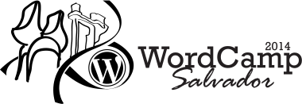

Este repositório é utilizado para compartilhar as peças e marcas utilizadas para divulgar o WordCamp Salvador.

## Como contribuir

1. Faça um Fork!
2. Crie um branch: `git checkout -b capa-facebook`
3. Commit suas alterações ou contribuições: `git commit -m 'Imagem de capa para facebook'`
4. Faça um push do seu branch: `git push origin capa-facebook`
5. Envie um pull request
6. Be happy 1. Fork it!
2. Create your feature branch: `git checkout -b my-new-feature`
3. Commit your changes: `git commit -m 'Add some feature'`
4. Push to the branch: `git push origin my-new-feature`
5. Submit a pull request :D
